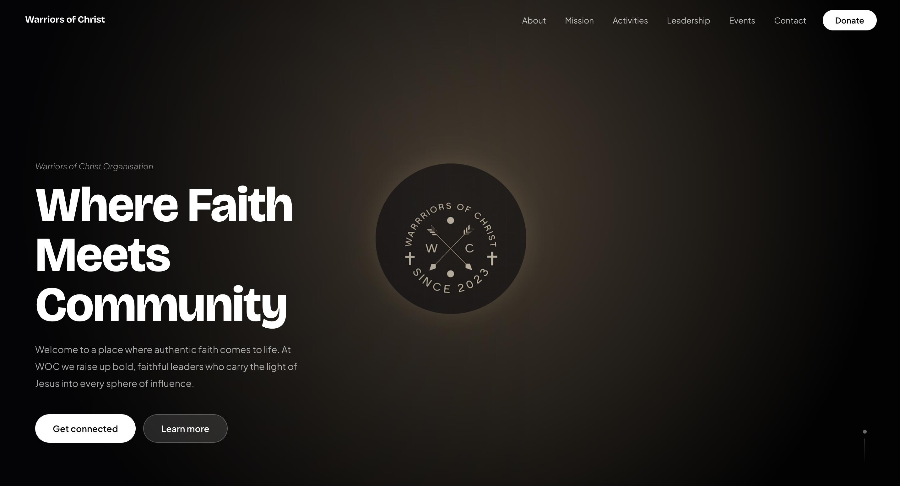

# Warriors of Christ (WOC) – Website

A modern, interactive web platform built for the **Warriors of Christ (WOC)** ministry. This website serves as a centralized digital hub where users can engage with the ministry, access key information, and participate in community-driven activities.

---

## ✨ Overview

The platform enables visitors to:

- Learn about the ministry’s mission and vision  
- Register as members  
- Share testimonies  
- Submit prayer requests  
- Make enquiries  
- Support the ministry financially  

---

## 🚀 Features

### Core Functionality

- **Responsive Design**  
  Seamless experience across desktop, tablet, and mobile devices  

- **Membership Registration**  
  Users can sign up, with data stored locally via `localStorage`  

- **Community Section**  
  Interactive engagement through:
  - Testimonies  
  - Prayer Requests  
  - Enquiries  

- **Leadership Portal**  
  Password-protected access for leaders to view member data  

- **Giving Section**  
  Displays official banking details for donations  

- **Social Media Integration**  
  Direct links to Instagram and TikTok  

- **Scroll Animations**  
  Smooth fade-in effects for enhanced user experience  

---

## 🛠️ Tech Stack

| Technology | Purpose |
|-----------|--------|
| **HTML5** | Structure and layout |
| **CSS3** | Styling, responsiveness, animations |
| **JavaScript** | Interactivity, data handling, authentication logic |

---

## 🧠 Technical Notes

- Fully client-side application (no backend integration yet)  
- Uses `localStorage` for data persistence  
- Leadership authentication is handled on the front end  
- Suitable for prototype/demo; requires backend for production-grade security  

---

## 🔮 Future Improvements

- Backend integration (e.g., Firebase or Node.js API)  
- Secure authentication and role-based access control  
- Email/notification system for submissions  
- Admin dashboard with analytics  
- Content management system (CMS)  

---

## 🔒 License

**All Rights Reserved.**

This project and its source code are the exclusive property of **Warriors of Christ (WOC)**.

- ❌ Unauthorized use, copying, modification, or distribution is strictly prohibited  
- ❌ No part of this codebase may be reused or reproduced without explicit written permission  
- 👁️ This repository is provided for viewing purposes only  

---

## 🤝 Contributions

This project is **not open for public contributions**.

For collaboration or usage inquiries, please contact the project owner directly.

---

## 📌 Notes

This project is actively evolving. Future updates will focus on scalability, security, and enhanced user engagement.
